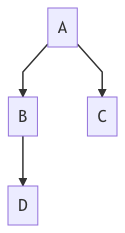
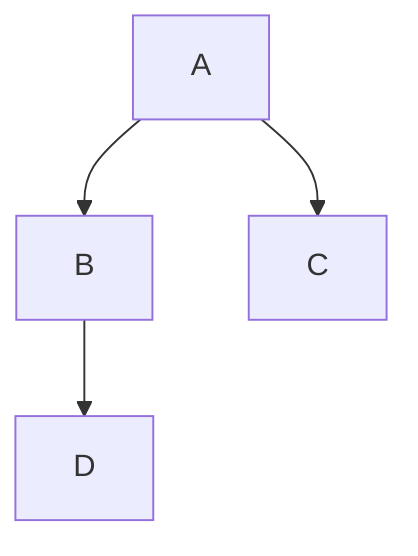
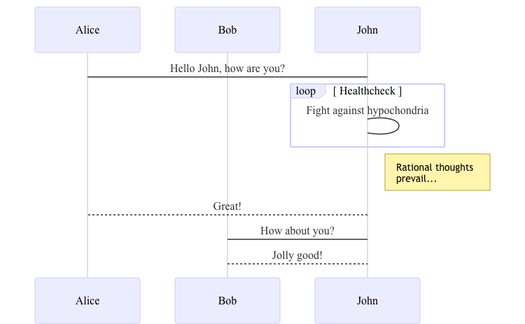
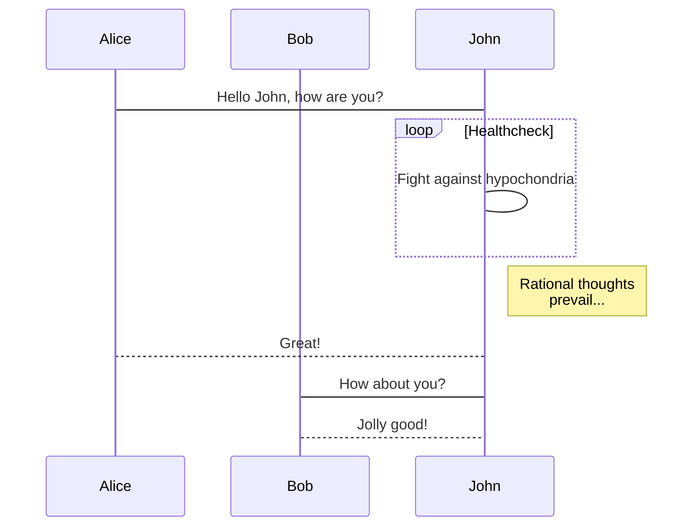
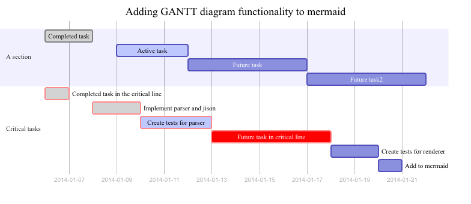
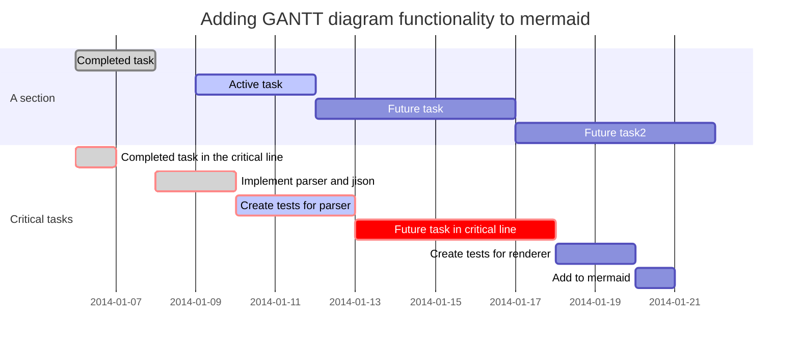

# Markdown mermaid
Shell script that generates mermaid diagram into images from .md files

## Setup
``` bash
npm install mermaid.cli # or npm install -g mermaid.cli
sh shell.sh ${input_file} ${output_file} ${break_separator}# run script
# sh shell.sh ./mermaid/README.md README.md 
```

### Example mermaid flowchart




### Example mermaid sequence diagram




### Example mermaid gantt diagram




